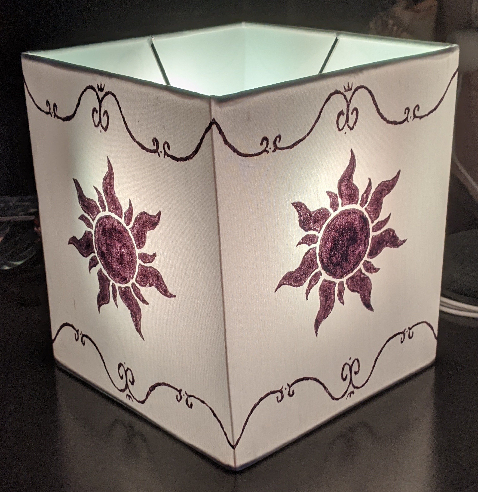

#Tangled Lantern

This is a recreation project of the photo opportunity with a lantern from the movie 'Tangled' available at Walt Disney World's Magic Kingdom.
The Arduino code is simple and meant to mimic the look of a candle, and the construction is made of a painted lampshade with the circuit hanging from inside it.

##The Code

The code will update the set of addressable LEDs on digital pin 6 every 100ms with the color adjusted randomly between 0 and 15.

##The Construction
The lantern is powered with an Arduino Pro Mini 3.3V.
The LED strips used are WS2812 5050 RGB 8 LED Light Strips.
The pattern I used to paint the lamp shade can be found [here](https://www.scribd.com/doc/54393894/Tangled-Style-Lantern)
Presently working on a PCB to attach to the lampshade instead of hanging the LED strips from the center ring.
The LED strips get power from the same battery pack that the Arduino board does, and all four LED strips are connected to the same digital pin 6 on the Arduino.
